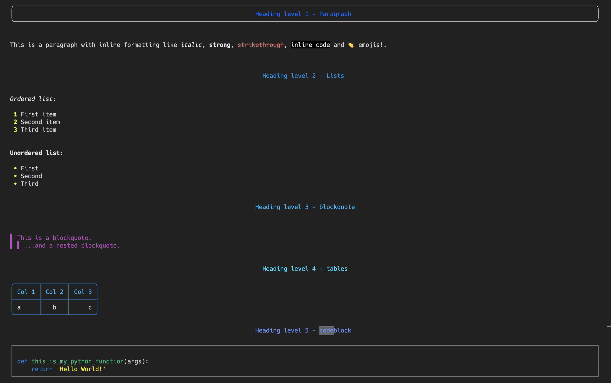

# Connect Markdown Renderer


 [](https://pypi.org/project/connect-markdown-renderer/) [](https://travis-ci.org/cloudblue/connect-markdown-renderer) [](https://codecov.io/gh/cloudblue/connect-markdown-renderer)


## Introduction

`connect-markdown-renderer` is a small library that allow to render markdown documents in a terminal shell.

## Requirements

`connect-markdown-renderer` requires Python 3.6+ and depends on the following libraries:

* ansicolors>=1.1.8,<2
* mistune==0.8.4
* pygments>=2.7.1<3


## Install

`connect-markdown-renderer` can be installed from pypi.org with pip:

```sh

$ pip install connect-markdown-renderer

```

## Usage example

```python

from cmr import render

my_md = """

# Heading level 1 - Paragraph

This is a paragraph.  

## Heading level 2 - Lists

*Ordered list:*

1. First item
2. Second item
3. Third item


**Unordered list:**

* First
* Second
* Third

"""

print(render(my_md))

```

This code will produce the following output:




## Limitation

`connect-markdown-renderer` does not support:

* Inline HTML
* Footnotes


## License

`connect-markdown-renderer` is released under the [Apache License Version 2.0](https://www.apache.org/licenses/LICENSE-2.0).
